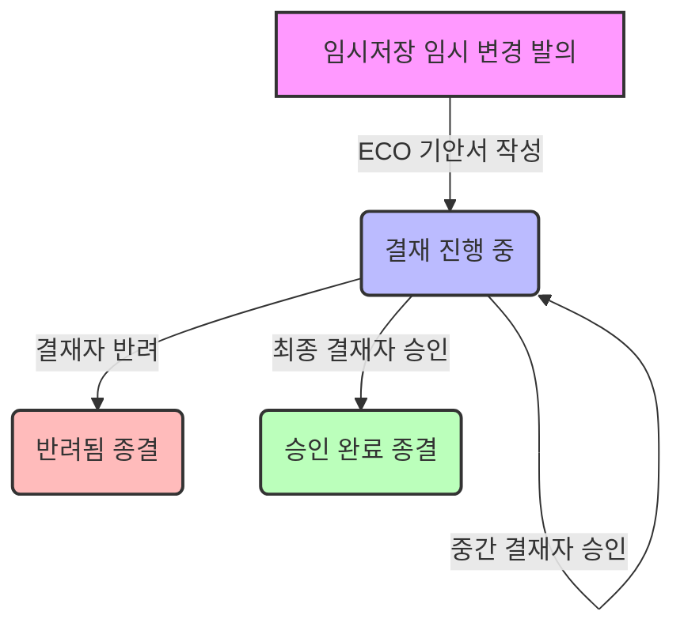

# ECO 설계변경 승인 시스템 (Engineering Change Order) 사용자 매뉴얼

ECO 설계변경 승인 시스템은 설계 변경 및 최초 릴리즈(BOM 수정) 건에 대하여 부서별(연구소, 생산, QA, 영업, 대표 등) 동적 전자결재선을 운영하고, 최종 승인 완료 시 자동으로 마스터 부품의 리비전 상승 및 BOM 관계를 갱신하는 통합 설계 승인 모듈입니다.

---

## 1. 개요 및 권한 정책

*   **메뉴 경로**: 사이드바 ➡️ **ERP** ➡️ **ECO 승인** (내부 라우트: `/eco`)
*   **주요 역할**: 5단계 이상의 동적 결재선 지정, 사양 변경 이력 기안, 변경 전/후 속성(Diff) 검토, BOM 구조 변동 내역(BOM Diff) 비교 검증, 최종 승인 시 마스터 파트 및 BOM 구조 자동 업데이트.
*   **권한 요구사항**:
    *   **일반 사원 (User/Guest)**: 기안 대기 및 처리 완료 문서 조회, 승인 이력 검토 가능.
    *   **결재 단계별 지정 담당자**: 기안자가 설정한 결재선에 지정된 담당 유저(`approverId`가 로그인한 사용자 UID와 일치하거나 `admin` 권한을 가진 계정)인 경우 결재 승인/반려 처리가 활성화됩니다.
        *   *참고*: 기본 프리셋 결재선은 1단계 연구소 담당자, 2단계 생산 담당자, 3단계 QA 담당자, 4단계 영업 담당자, 5단계 대표로 매핑됩니다.

---

## 2. 화면 구성 및 보여지는 데이터 설명

### 2.1 메인 화면 탭 및 리스트 구성
메인 화면 상단에서 세 가지 뷰 모드를 전환하여 업무를 처리합니다.

*   **결재 대기함 (결재 진행 중)**:
    *   현재 결재가 진행 중인 `Status == 'Pending'` 상태인 문서들의 목록을 표시합니다.
    *   자신이 결재할 차례인 안건의 경우, 리스트 타이틀 왼쪽에 파란색 펄스(Pulse) 점이 활성화되어 시각적으로 즉시 강조됩니다.
*   **처리 완료함 (완료 이력)**:
    *   최종 승인이 완료(`Status == 'Approved'`)되었거나, 결재 과정에서 반려(`Status == 'Rejected'`)되어 종결된 문서들을 보여줍니다.
    *   완료함에서는 최종 승인/반려를 처리한 담당자의 이름과 종결 처리 일시(`ProcessedAt`)가 추가적으로 노출됩니다.
*   **설변 대기 리스트 (임시 저장 항목)**:
    *   BOMPage 등에서 사양 변경 또는 BOM 구조를 임시 기안했으나, 아직 ECO 승인서로 묶이지 않은 순수 대기 데이터(`Status == 'Draft'`)들입니다.
    *   우측 상단의 **[ECO 승인서 작성]** 버튼을 통해 이곳에 쌓인 항목들을 체크하여 하나의 결재서로 기안할 수 있습니다.

### 2.2 리스트 컬럼 (MasterDataGrid) 정의
| 컬럼명 (레이블) | 필드 키 | 설명 |
| :--- | :--- | :--- |
| **문서번호** | `ECNNumber` | 생성된 ECO 문서 고유 번호 (예: `ECN-YYYYMMDD-SEQ` 포맷) |
| **승인서 제목** | `Title` | 기안자가 입력한 ECO 결재서 제목 |
| **구분** | `ECNType` | 변경 건의 성격 (`정규` / `임시`) |
| **발행일자** | `PublishDate` | 기안자가 지정한 문서 발행일 (YYYY-MM-DD) |
| **상태** | `Status` | 전체 결재 상태 (`결재 진행 중` / `승인 완료` / `반려됨`) |
| **결재 현황** | `CurrentStep` | 총 결재선 단계 중 현재 결재 진행 단계를 백분율 형태의 막대그래프 배지로 시각화 |
| **기안자** | `RequestedBy` | ECO 승인서를 작성하고 결재를 상신한 담당자 이름 |
| **기안/처리 일시** | `CreatedAt` / `ProcessedAt` | 최초 상신일 또는 최종 승인/반려로 종결 처리된 시각 (완료 이력 탭에서는 처리 일시 표시) |

### 2.3 상세 결재 모달 (Detail Modal) 데이터 정의
목록에서 특정 문서를 클릭하면 상세 관제 창이 노출되며, 아래 정보들이 시각화됩니다.
*   **결재선 타임라인 (Timeline Indicator)**:
    *   각 결재 단계(1단계 ~ N단계)가 선으로 연결되어 표시됩니다.
    *   **상태별 색상**: 녹색 체크(해당 단계 승인 완료), 빨간 X(반려 처리됨), 파란 펄스(현재 결재 대기 중인 단계), 회색(미래 단계).
    *   각 노드 하단에 지정된 결재자 이름과 결재 처리 완료자의 실제 성함이 표시됩니다.
*   **ECO 기본 메타 정보**:
    *   발행일자, 적용 시리즈, 통신 방법(PT, RS485, CAN, TTL 등), 구분 및 적용될 목표 Revision No.가 표시됩니다.
    *   **BOM 설계변경 대상 모델**: 변경 스펙이 물리적으로 적용되는 완제품 품번 목록.
    *   **리비전 동기화 대상 모델**: 직접적인 BOM 변경은 없으나 동일 시리즈 내 리비전 일치를 위해 버전을 함께 상승시키는 모델 목록.
    *   **공표 사양 변경 유무**: 스펙/도면 변경 수반 시 상세 변경 설명 제공.
    *   **개선 효과 & Note**: 기안서 작성 단계에서 등록된 신뢰성 개선 효과 및 재고 조치 지침 등 특기 사항.
*   **설계변경 대상 목록 (기안 묶음)**:
    *   이 결재서에 포함되어 있는 개별 변경 건(Draft Items)의 리스트.
    *   각 카드 내에 분류(`BOM 구조 변경` 또는 `부품 스펙 변경`), 대상 품번/품명, 발의자, 변경 사유 및 기안 시 등록된 **세부 변경 내역(Diff)**이 목록 형식으로 출력됩니다.
*   **결재 진행 이력 (ApprovalHistory)**:
    *   이전에 통과한 단계의 승인/반려 여부, 담당자 성명, 입력한 **결재 의견(Comment)**, 결재 시각이 시간 순으로 나열됩니다.
*   **결재 처리 영역**:
    *   현재 결재 순서에 해당하는 담당자에게만 노출되는 입력 박스로, 승인 코멘트 입력창과 [반려 처리], [승인 완료] 실행 버튼으로 구성됩니다.

---

## 3. 자료 입력 설명 (ECO 승인서 기안 작성)

설변 대기 리스트(`DRAFT_ITEMS`) 탭에서 **[ECO 승인서 작성]** 버튼을 클릭하여 새로운 기안서를 작성할 때 입력해야 하는 항목들입니다.

### 3.1 기본 정보 입력 및 동적 필터링
*   **승인서 제목**: 이번 설계변경 승인을 대표하는 명확한 제목을 작성합니다. (필수 입력)
*   **발행일자**: 문서의 공식 발행일을 선택합니다. (기본값: 당일 날짜)
*   **적용 분류 (Category)**:
    *   설계변경이 발생하는 제품군 분류 (`Actuator`, `Board`, `Mechanical Parts`, `ETC`)를 선택합니다.
    *   `Actuator` 선택 시: `bom_folders` API에서 `parentId`가 Actuator 카테고리 ID인 하위 시리즈(Series) 목록이 동적으로 필터링되어 시리즈 선택창에 노출됩니다.
    *   `Board` 선택 시: 시리즈 필터 없이 모든 완제품 보드 리스트(`Category`가 'Board', 'PCB', 'PCBA' 등인 마스터 부품)가 호출됩니다.
*   **시리즈 선택**: 분류가 `Actuator`인 경우 활성화되며, DB에 등록된 하위 시리즈 목록 중 해당하는 모델 라인을 지정합니다.
*   **구분 (Type)**: `정규` 변경(양산 적용)인지 `임시` 변경(개발/샘플 테스트 등)인지 지정합니다.
*   **통신 방법 & Stroke 길이**:
    *   다중 선택 체크박스 방식으로, 해당 사양에 부합하는 완제품 모델들을 적용 대상군으로 필터링하는 데 사용됩니다.
    *   입력된 완제품의 `Spec` 텍스트 필드를 파싱하여 정규식(Regex) 매칭 검사를 수행해 조건에 부합하는 품번(`PartID`) 목록을 선별합니다.

### 3.2 적용 대상 모델 및 리비전 플랜 설정
*   **적용 대상 모델 (완제품) 목록**:
    *   위에서 설정한 분류, 시리즈, 통신 방식, 스트로크 필터 조건에 매칭되는 마스터 부품(완제품)들이 리스트로 나열됩니다.
    *   **시리즈 전체 적용**: 이 체크박스를 선택하면 조건부 필터를 우회하여 해당 시리즈에 속한 모든 완제품 모델이 자동으로 ECO 적용 대상에 편입됩니다.
    *   **Revision No. (계획) & 개별 리비전 증가**:
        *   **일괄 지정**: 공통 입력란에 리비전 번호(예: `2.0`)를 입력하면 대상 모델 전체의 리비전이 해당 값으로 일괄 설정됩니다. (기본값은 선택된 모델들 중 최대 리비전에 0.1을 더한 값)
        *   **개별 +0.1 증가**: 체크박스를 활성화하면 일괄 입력창이 비활성화되는 대신, 우측에 개별 리비전 입력칸이 오픈되어 완제품별로 각각 적용할 목표 리비전을 미세 조정할 수 있습니다. (개별 모델의 현재 리비전 + 0.1이 자동으로 초기값으로 세팅됨)
*   **공표 사양 변경 발생 유무**: 체크 시 스펙서나 도면의 변경 내역을 기술할 수 있는 텍스트 필드가 열립니다.
*   **개선 효과 & Note**: 설계변경의 비즈니스적 가치(단가 절감, 불량률 감소 등)와 구형 재고 조치 방안 등의 특기사항을 기입합니다.

### 3.3 설계변경 대상 및 결재선 지정
*   **설계변경 리스트 추가 대상 지정**: 현재 대기 중인 임시 변경 건(`ecn_draft_items`) 목록이 카드로 노출되며, 이번 ECO 승인서에 묶을 대상들을 체크박스로 다중 선택합니다. (최소 1개 이상 선택 필수)
*   **결재 설정 (동적 결재선)**:
    *   기본적으로 5단계 결재선(연구소 ➡️ 생산 ➡️ QA ➡️ 영업 ➡️ 대표) 프리셋이 자동으로 불러와지며, 부서별 담당 유저가 매핑됩니다.
    *   **[결재 단계 추가]** 버튼을 통해 단계를 추가하거나, 휴지통 아이콘을 클릭하여 불필요한 단계를 제거하는 등 유연한 동적 결재선 설계가 가능합니다.
    *   각 결재 노드의 **결재선 라벨(텍스트)**과 **결재 유저(셀렉트 박스)**는 수정 가능하며, 결재자가 지정되지 않은 빈 단계가 있으면 기안 제출이 차단됩니다.

---

## 4. 상태 변경 설명 (비즈니스 로직 및 데이터 워크플로우)

결재의 흐름에 따라 데이터베이스(`Firestore`) 내 관련 컬렉션의 데이터들이 유기적으로 자동 갱신됩니다.

### 4.1 기안서 제출 시점
*   **상태 변경**: ECO 문서(`'ecns'` 컬렉션)가 신규 생성되며 상태(`Status`) 필드가 `'Pending'`으로 등록되고, 현재 진행 단계(`CurrentStep`)가 `0`으로 설정됩니다.
*   **문서번호 발행**: 문서번호(`ECNNumber` 필드)는 `ECN-YYYYMMDD-XXXX` (XXXX는 당일 발행된 순번의 4자리 패딩 값) 형식으로 고유하게 생성됩니다. (하위 데이터 호환성을 위해 식별자 키와 포맷 유지)
*   **대상 품목 제어**: 선택된 대기 항목들(`'ecn_draft_items'` 컬렉션)의 `Status`가 `'Draft'`에서 `'Pending ECN'`으로 전환되며, 해당 항목들에 고유 문서번호(`ECNNumber`)가 주입되어 타 기안서에 중복 묶임되는 것을 방지합니다.

### 4.2 중간 결재 단계 승인 시점
*   **상태 변경**: 전체 ECO 상태(`Status`)는 여전히 `'Pending'`으로 유지되나, 현재 결재 차례를 나타내는 `CurrentStep` 지표가 `1`씩 증가하여 다음 결재선 담당자에게 처리 권한을 넘깁니다.
*   **기록 누적**: 처리 정보(결재자, 승인 의견, 처리 시간, 'Approved' 상태)가 담긴 객체가 ECO 문서 내 `ApprovalHistory` 배열 필드에 즉시 누적 기록됩니다.

### 4.3 최종 승인 (종결) 시점
결재선 상의 마지막 결재자가 [승인 완료]를 실행하면 전체 시스템 마스터 데이터에 반영되는 중대한 업데이트 이벤트가 발생합니다:
1.  **ECO 문서 상태 종결**: ECO 문서의 `Status`가 `'Approved'`로 변경되며, 최종 승인자(`ApprovedBy`) 및 처리 시각(`ProcessedAt`)이 확정 기록됩니다.
2.  **마스터 파트 리비전 일괄 업데이트**: 
    *   ECO에 설정된 모든 적용 대상 완제품 모델(`TargetModels` 및 `SeriesModels`)을 `'parts'` 컬렉션에서 조회합니다.
    *   각 부품의 리비전 속성(`Rev`, `Revision`)을 기안 단계에서 예고했던 신규 리비전 번호(일괄 지정된 번호 또는 개별 증가된 리비전)로 증가시키고 `LastModified` 타임스탬프를 갱신합니다.
3.  **기존 BOM 리비전 동기화**:
    *   대상 완제품 모델의 하위 자재 구성 레코드 중 `'bom'` 컬렉션에 적재되어 있던 기존 레코드의 리비전 속성(`Revision`) 값을 신규 리비전 번호로 동기화합니다.
4.  **BOM 구조 관계 영구 갱신**:
    *   기안서 묶음에 포함된 항목 중 `Type`이 `'BOM Change'`인 대상 완제품 모델에 대해, `'bom'` 컬렉션에 적재되어 있던 기존 하위 자재 구성 레코드(ParentID가 해당 완제품인 항목)를 전체 영구 삭제 처리합니다.
    *   기안자가 작성했던 신규 BOM 설계안(`ProposedBOM` 배열)을 기반으로 새로운 자재 정보, 소요량(`Quantity`), 위치값(`Location`), 비고(`Note`)를 담은 BOM 레코드들을 최신 리비전 번호를 주입하여 `'bom'` 컬렉션에 대거 삽입(`Batch Write`)합니다.
5.  **임시 항목 상태 종결**: 묶여있던 모든 `ecn_draft_items` 문서들의 `Status`가 `'Approved'`로 변경되어 최종 처리 완료 상태로 종결됩니다.

### 4.4 결재 반려 시점
결재 진행 중 어느 단계에서든 [반려 처리]를 클릭하면 다음과 같이 원상 복구됩니다:
*   **ECO 문서 상태 종결**: ECO 문서의 `Status`가 `'Rejected'`로 변경되며, 반려 사유(`RejectReason`), 반려 처리자(`RejectedBy`) 및 처리 시각(`ProcessedAt`)이 기록되고 반려 레코드가 `ApprovalHistory`에 추가됩니다.
*   **임시 항목 원복**: 기안서에 묶여있던 모든 대기 품목(`ecn_draft_items`)들의 `Status`가 `'Pending ECN'`에서 `'Draft'`로 즉시 복원되어, 다른 기안서에 다시 추가할 수 있는 상태로 초기화됩니다.
*   **부품 상태 원복**: `'parts'` 컬렉션에서 기안 대상이었던 부품들의 상태(`Status`)가 `'Approved'`로 원상 복구됩니다.

---

## 5. 상태 변경 시 발생하는 이벤트 (실시간 알림 발송)

ECO 문서의 상태가 변경될 때마다 관련 부서 및 전체 사용자에게 실시간 시스템 알림이 즉시 발송됩니다. 알림 발송은 `createNotificationByRoute` 서비스를 이용해 웹앱 내 최상위 레이어에 플로팅 팝업 및 알림함 데이터로 기록됩니다.

### 5.1 중간 결재 승인 이벤트 (Notification 1)
*   **발생 타이밍**: 결재자가 승인했으나 아직 최종 단계에 도달하지 않은 경우.
*   **이벤트 내용**:
    *   **이동 경로 (Route)**: `/eco` (ECO 승인 페이지)
    *   **알림 제목**: `ECO 결재 승인`
    *   **알림 메시지**: `ECO [문서번호] 건이 [현재 결재단계 라벨] 단계를 통과하였습니다.`
    *   **효과**: 다음 단계 결재자들에게 신속한 결재 대기 알림을 인지시킵니다.

### 5.2 최종 승인 완료 이벤트 (Notification 2)
*   **발생 타이밍**: 최종 결재자가 승인을 완료하여 마스터 데이터 및 BOM 갱신이 완료된 즉시.
*   **이벤트 내용**:
    *   **이동 경로 (Route)**: `/parts` (부품 관리 페이지)
    *   **알림 제목**: `ECO 최종 승인 완료`
    *   **알림 메시지**: `ECO [문서번호] 설계변경 건이 최종 승인되었습니다.`
    *   **효과**: 전 부서 담당자들이 최신 리비전 부품 및 BOM을 즉시 사용하도록 공표합니다.

### 5.3 결재 반려 이벤트 (Notification 3)
*   **발생 타이밍**: 결재자가 반려를 확정하여 문서가 종결된 즉시.
*   **이벤트 내용**:
    *   **이동 경로 (Route)**: `/eco` (ECO 승인 페이지)
    *   **알림 제목**: `ECO 결재 반려`
    *   **알림 메시지**: `ECO [문서번호] 건이 반려 처리되었습니다. 사유: [기입한 반려 의견]`
    *   **효과**: 기안자 및 관계 부서 담당자들에게 설계변경 보완 및 재기안 필요성을 통보합니다.
