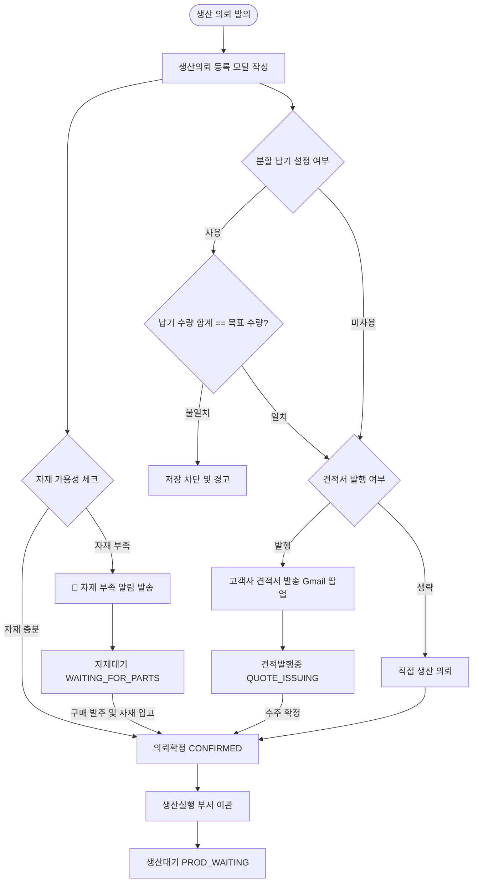

# 생산 의뢰 (Production Requests) 사용자 매뉴얼

생산 의뢰 메뉴는 영업팀에서 고객사 수주 및 사내 재고용 완제품의 생산을 요청하고, 전사 자재 가용성을 사전 시뮬레이션 검증한 뒤 견적서 발행 및 최종 작업지시서 인쇄를 제어하는 통합 상신 센터입니다.

---

## 1. 개요 및 권한 정책

*   **메뉴 경로**: 사이드바 ➡️ **ERP/SCM** ➡️ **Production Requests (생산 의뢰)**
*   **주요 역할**: 신규 생산 요청 등록, 다중 일정/분할 납기 수립, 실시간 자재 가용성 및 누적 부족 트래킹, 견적 이메일 Gmail 발송, 작업지시서(Work Order) 인쇄 및 외부 ERP(ECount) 전송 이력 조회.
*   **권한 요구사항**:
    *   **일반 사원 (User/Guest)**: 생산 의뢰 목록 조회, 자재 가용성 트리 조회, 작업지시서 인쇄 화면 진입 가능.
    *   **영업/관리 부서 (Engineer/Manager 이상)**: 신규 생산 의뢰 등록, 분할 납기 스케줄 변경, 고객사 견적서 발행, 작업지시 기안 상신 가능.

---

## 2. 생산 의뢰 리스트 화면 구성

목록 뷰는 의뢰의 진행 주기에 따라 **3개 탭**으로 관리됩니다.

### 2.1 진행 단계별 목록 [탭 (🧭 위치 보기)](tour://pr-tabs)
*   **신규/검토함 (Active)**: 임시저장(`DRAFT`), 견적발행중(`QUOTE_ISSUING`), 생산검토(`REVIEW`), 의뢰확정(`CONFIRMED`), 자재대기(`WAITING_FOR_PARTS`) 상태의 활성 의뢰 목록.
*   **생산/검사함 (Production)**: 생산대기(`PROD_WAITING`), 생산계획(`PROD_PLANNING`), 작업지시(`WORK_ORDER`), 생산중(`IN_PRODUCTION`), 생산완료(`PROD_COMPLETE`), QA검사대기(`QA_WAITING`), QA검사완료(`QA_COMPLETE`), 출하준비(`SHIP_READY`) 상태의 공장 진행 의뢰 목록.
*   **종결/완료함 (History)**: 출하완료(`SHIPPED`/`COMPLETED`), 아카이브(`ARCHIVED`), 의뢰취소(`CANCELLED`) 상태의 종결 의뢰 목록.

### 2.2 리스트 컬럼 및 [레이블 정의 (🧭 위치 보기)](tour://pr-list-row)
| 레이블명 | 필드 키 | 설명 |
| :--- | :--- | :--- |
| **PR 번호** | `PRNumber` | 고유 생산 의뢰 번호 (`PR-YYYYMMDD-RANDOM`) |
| **제품명** | `PartName` | 생산 대상 대표 완제품/반제품 명칭 |
| **고객사** | `CustomerName` | 납품 대상 수주 고객사 명칭 |
| **수량** | `TargetQty` | 총 목표 생산 수량 (EA) |
| **단가** | `UnitPrice` | 제품 단가 (KRW / USD) |
| **총 금액** | `TotalAmount` | (수량 × 단가) 자동 계산 금액 |
| **납기일** | `DueDate` | 고객 납품 희망일자 |
| **상태** | `Status` | 임시저장부터 출하완료까지의 흐름 상태 |
| **등록일** | `CreatedAt` | 최초 의뢰 상신 등록일자 |

---

## 3. 신규 생산 의뢰 등록 및 견적서 발행 (모달 폼)

우측 상단의 **[[생산의뢰 등록 (🧭 위치 보기)](tour://pr-register-btn)]** 버튼 클릭 시 활성화되는 복잡한 연동 폼 모달입니다.

### 3.1 입력 항목 및 레이블
*   **공통 정보 (Common Form)**:
    *   **고객사 선택**: 기존 고객사 리스트 드롭다운. 우측의 '신규 등록' 클릭 시 간단한 고객사 정보(`Name`, `Contact`, `Email`)를 즉시 기재하여 DB에 신규 저장 가능.
    *   **납기 희망일 (필수)**: 달력 지정.
    *   **대금 지불 예정일**: 예상 수납일 지정.
    *   **긴급 생산 여부**: 체크 시 목록 상에 `🔴 긴급` 뱃지가 강제 깜빡입니다.
    *   **비고 (Remarks)**: 작업 주의사항 및 지시 내용.
*   **제품 항목 추가 (Item Form)**:
    *   **분류**: 완제품, 반조립품, 부품, 액세서리 구분.
    *   **제품명**: 해당 분류에 매핑된 마스터 파트 리스트 중 선택.
    *   **버전**: 선택 품목의 리비전 버전 번호 자동 및 수동 바인딩.
    *   **수량 & 통화/단가**: 생산 수량과 기준 통화(KRW/USD) 및 수주 단가 입력.

### 3.2 핵심 기능 및 실시간 유효성 제어

#### ① 자재 가용성 체크 (Availability Check) **[핵심 알고리즘]**
*   **자재 가용성 체크 버튼**을 누르면, 시스템은 추가된 품목들의 BOM 구조를 재귀적으로 분석하여 창고 내 물리적 가용 재고(OnHand - 타 공정 예약분 Reserved)와 즉시 대조합니다.
*   **결과 표기**:
    *   **초록색 (자재 충분)**: "생산 가능: X EA / 부족: 0 EA". 하위 자재 재고가 모두 충족되어 생산 즉각 돌입 가능함을 표기.
    *   **빨간색 (자재 부족)**: "생산 가능: Y EA / 부족: Z EA". 최종적으로 조달이 필요한 하위 원자재 목록과 각 자재의 현재 보유량, 필요량, 순수 부족 수량이 **단층 아코디언 패널**에 리스트업됩니다.

#### ② 분할 납기 수립 (Split Delivery Schedules)
*   **분할납기 버튼**을 누르면, 단일 완제품 주문에 대해 수 차례에 걸친 납기 분할 일정을 구축할 수 있습니다.
*   **유효성 검사**: 각 납기일 차수별 지정 수량의 합계가 최초 요청 수량(`TargetQty`)과 100% 일치해야만 승인 저장이 가능하며, 불일치할 경우 에러 가이드와 함께 저장이 블로킹됩니다.

#### ③ 견적서 Gmail 자동 작성 및 임시 발주서 생성
*   기재된 정보를 기반으로 시스템 고유의 견적 번호(`QUOTE-YYYYMMDD-XXXX`)를 자동 빌드합니다.
*   **견적서 발행** 클릭 시, 고객사 수신 이메일 주소, 품목별 단가 및 수량 테이블, 합계 금액, 납기일, 분할 납기 상세 텍스트가 모두 기입된 **구글 Gmail 메일 작성 창**을 팝업 형태로 화면에 즉각 로드해 줍니다.
*   메일 전송과 동시에 의뢰 상태는 `견적발행중(QUOTE_ISSUING)`으로 자동 전환됩니다.

#### ④ 자재 부족 알림 푸시
*   가용성 분석 결과 부족 자재가 1개라도 존재하는 상태에서 이메일을 건너뛰고 생산의뢰를 강제 확정(`CONFIRMED`)시키면, 구매(`purchasing`) 및 생산(`production`) 부서 전체에 **'🚨 자재 부족 알림 (통합 PR)'** 시스템 알림을 자동으로 전파하여 선제 발주를 유도합니다.

---

## 4. 상태 변화 및 업무 처리 순서 (Workflow)

생산 의뢰가 상신된 후 공정으로 넘어가기까지의 전체 흐름과 각 상태별 업무 처리 순서는 다음과 같이 제어됩니다.

### 4.1 생산 의뢰 비즈니스 프로세스 흐름도

### 4.2 단계별 상태 전환 기준 및 제약 조건

| 현재 상태                 | 액션 및 조건                       | 전환 상태         | 연동 시스템 및 비즈니스 규칙                                                                     |
| :-------------------- | :---------------------------- | :------------ | :----------------------------------------------------------------------------------- |
| **DRAFT** (임시저장)   | - 임시저장 데이터 저장 시               | **DRAFT**     | 작업 중간 저장용으로, 생산 및 구매 부서에 노출되지 않음                                                     |
| **DRAFT**             | - 견적서 발행 클릭 시 (Gmail 발송 연동)   | **견적발행중**  | 고객사 이메일 주소로 견적 양식을 포매팅하여 이메일 팝업을 띄우고 상태 전환                                           |
| **견적발행중**             | - 고객사 수주 승인 및 직접 의뢰 전환        | **의뢰확정**   | 영업 수주 확정으로 처리하여 생산 대기 상태로 이관 준비                                                      |
| **DRAFT** / **견적발행중** | - 이메일 생략하고 직접 의뢰 등록 시 자재 검증   | 자재대기       | 가용성 체크 시 1개 이상의 원부자재가 부족할 경우 전환되며, **구매/생산 부서에 알림**을 발송하여 긴급 조달 유도                   |
| 자재대기                  | - 발주한 자재가 창고로 입고 완료되어 재고 확보 시 | **의뢰확정**   | 시스템이 수시로 가용성을 재검증하여 부족분이 해소되면 확정 상태로 변경                                              |
| **의뢰확정**              | - 생산 부서에서 생산 계획을 수립하기 시작할 때   | **생산대기**   | 생산 의뢰 데이터가 공장 생산 실행 모듈(Production Execution)로 정식 인계됨                                 |
| **생산대기** 이후           | - 공정 관리 진행                    | *생산 실행 단계*    | 생산 계획 수립(`PROD_PLANNING`) ➡️ 작업지시(`WORK_ORDER`) ➡️ 생산중(`IN_PRODUCTION`) ➡️ 완료 순으로 이행 |
| **임의 상태**             | - 의뢰 철회 또는 수주 취소 발생 시         | **의뢰취소**   | 프로세스 즉시 중단. 기존 예약되어 있던 자재 가용량(Reserved)이 자동으로 해제됨                                    |

