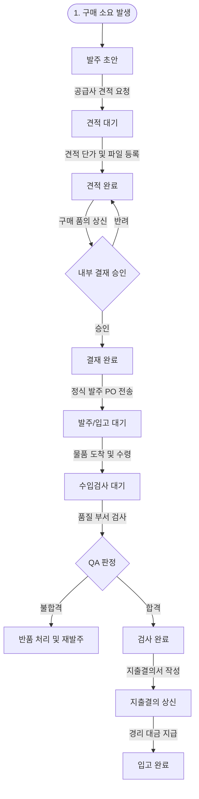

# 발주 관리 (Purchasing) 사용자 매뉴얼

발주 관리 메뉴는 사내 재고 안전 수준(Safety Stock) 미달 품목 및 생산 부족 자재에 대하여 공급업체별 다중 품목 견적 요청(RFQ), 견적서 수취 및 기안서 내부 결재를 진행하고, 최종 입고 및 품질 검사 이송 후 지출결의(결제 정산)까지 처리하는 구매 파이프라인 관제 센터입니다.

---

## 1. 개요 및 권한 정책

*   **메뉴 경로**: 사이드바 ➡️ **SCM** ➡️ **Purchasing (발주 관리)**
*   **주요 역할**: 견적요청서 및 발주서 작성, 단가 수합, 구매 승인 기안, 입고 및 품질(QA) 이송 연동, 경리 지출결의서 작성.
*   **권한 요구사항**:
    *   **일반 사원 (User/Guest)**: 진행 중인 발주 상태 및 내역 조회, 거래 업체 정보 조회 가능.
    *   **구매 담당자 (Purchasing Manager 이상)**: 발주 요청서 작성, 공급사 메일 발송, 견적 파일 업로드, 품의 기안서 제출, 경리 지출결의서 기안.
    *   **경리 및 최종 승인자 (Manager/CEO/Admin)**: 기안서 결재 승인, 지출결의 대금 승인 및 마스터 입고 적재 확정.

---

## 2. 발주 진행 라이프사이클 및 액션 제어

발주 문서는 진행 단계에 따라 각 테이블 행에 표시되는 **액션 아이콘(버튼)**을 통해 후속 태스크를 직관적으로 처리합니다.

### 2.1 단계별 프로세스 가이드

| 진행 상태             | 의미                      | 수행 가능 실무 액션                                                                                                                                                                                               |
| :---------------- | :---------------------- | :-------------------------------------------------------------------------------------------------------------------------------------------------------------------------------------------------------- |
| **발주 초안** | 구매 요청을 임시 생성한 초기 상태.    | **견적 요청(RFQ) 메일 발송**: 공급업체로 규격 및 수량이 담긴 견적 요청 메일을 발송합니다. 메일 발송 시 문서 상태는 `견적요청발송`으로 자동 업데이트됩니다.                                                                                                           |
| **견적 대기** | 메일 발송 후 업체 답변을 기다리는 상태. | **견적서 업로드**: 업체 회신 단가 정보를 기입하고 첨부 견적서 파일(PDF/이미지)을 시스템에 업로드합니다. 업로드 시 상태는 `견적완료`로 전환됩니다.                                                                                                                |
| **견적 완료**         | 단가 수합이 완료된 상태.          | **기안서 작성 (품의)**: 내부 결재 라인을 지정하고 예산 승인을 위한 기안서 결재창([ApprovalModal](file:///D:/workspace/IR_Assistant/src/components/ApprovalModal.jsx))을 띄워 상신합니다. 상태는 `결재대기`가 됩니다.                            |
| **결재 완료**         | 내부 예산 승인이 끝난 상태.        | **최종 발주서(PO) 발송**: 업체로 정식 납품을 요구하는 PO(Purchase Order) 메일을 발송합니다. 상태는 `주문진행중`이 됩니다.                                                                                                                     |
| **주문 / 입고대기**     | 물류 배송 및 입고를 기다리는 상태.    | **입고 확인 및 QA 이송**: 물품이 창고에 도착하면 수령 확인 처리를 실행합니다. 확인 즉시 자재는 수입 검사 대기열([QAInspectionModal](file:///D:/workspace/IR_Assistant/src/components/QAInspectionModal.jsx))로 자동 이송되며 상태는 `검사대기`가 됩니다. |
| **검사 완료**         | 품질 검사(QA)를 합격 통과한 상태.   | **지출결의서 작성**: 물품 인수와 합격 검증이 완료되었으므로 대금 결제를 위한 경리 지출결의서([ExpenseResolutionModal](file:///D:/workspace/IR_Assistant/src/components/ExpenseResolutionModal.jsx))를 기안합니다.                                     |
| **지출결의**          | 지출 결의서 상신 완료.           | 최종 대금 지급 및 재고 마스터 확정 단계 진입 대기. 상태는 `지출결의중`이 됩니다.                                                                                                                                                                            |
| **입고 / 완료**       | 입고 및 정산이 모두 끝난 종결 상태.   | 재고 적재 완료 및 거래 완료함(History Tab)으로 이동.                                                                                                                                                                      |

---

## 3. 발주서 작성 및 이메일 전송 (핵심 UI 기능)

### 3.1 신규 발주 요청서 작성 
*   **다중 품목 일괄 등록**: 하나의 공급업체에 여러 부품을 한 발주서에 담아 발주를 진행할 수 있습니다.
*   **가로 정렬 입력 항목**:
    *   `부품 선택`, `리비전 정보`, `발주 요구 수량`, `단가` 정보가 행 단위로 가로 정렬되어 표기됩니다.
    *   **[부품 추가]** 버튼을 통해 다량의 자재를 계속 행 추가할 수 있으며 하단에 전체 **합계 예상 금액**이 실시간 자동 산출됩니다.

### 3.2 RFQ/PO 이메일 발송 설정
*   **리비전 노출 선택 기능**: 내부 보안 유출 방지 및 외부 제작업체의 혼선을 줄이기 위해, 메일 본문 생성 시 **부품의 도면 리비전 번호 노출 여부**를 체크박스로 선택 제어할 수 있습니다.
*   **해외 통관/리드타임 정보**: 해외 수입 자재의 경우, 해당 자재 정보 카드에 기재된 평균 통관 리드타임을 기반으로 물류 추적 및 예상 입고일이 역산되어 기입됩니다.

---

## 4. 경리 및 정산 프로세스 연동 (Expense Resolution)

수입 검사가 종료되면 경리 부서에서 대금을 지급하고 세금계산서를 수령하는 최종 관문입니다.
*   **지출결의서 등록 모달**:
    *   공급가액, 부가세(VAT) 자동 계산 기능을 지원합니다.
    *   공급사 계좌 정보 및 입금 요청일 입력.
    *   수령한 **세금계산서 PDF/이미지 및 세부 증빙 영수증 문서**를 첨부 파일로 바인딩하여 저장합니다.
*   최종 제출된 지출결의 정보는 PostgreSQL DB의 `purchasing` 컬렉션의 결제 로그 상태값(`PaymentStatus === 'RESOLVED'`)과 함께 세금계산서 정보가 동기화 저장됩니다.

---

## 5. 발주 업무 처리 순서 및 데이터 연동 흐름 (Workflow)

발주 생성부터 검수 및 정산 종결까지 진행되는 전체 업무 파이프라인의 처리 순서 및 흐름은 다음과 같습니다.

### 5.1 발주 프로세스 흐름도

### 5.2 단계별 정보 입출력 및 제약 사항

*   **1단계: 초안 작성**
    *   **입력**: 공급사(Vendor ID), 발주예정일, 납기요구일, 발주 품목(Part ID, 수량, 희망 단가), 통화(KRW/USD).
    *   **제약**: 등록할 부품은 반드시 마스터 파트 DB(`parts`)에 등록되어 있어야 합니다.
*   **2단계: 견적 대기 및 완료**
    *   **입력**: 공급업체 수합 단가, 납품 리드타임(일), 견적서 PDF 파일.
    *   **출력**: 메일 본문(도면 리비전 정보 포함 여부 체크 박스 제공).
*   **3단계: 품의 및 예산 승인**
    *   **제약**: 총 발주 금액이 사내 전결 기준액을 초과할 경우 다단계 결재선(구매팀장 ➡️ 본부장 ➡️ 대표)이 동적으로 지정되며, 결재 미완료 시 정식 PO 발행이 불가능합니다.
*   **4단계: 품질 검사 이송**
    *   **연동**: 물품 수령 확인 버튼 클릭 즉시, 해당 수량만큼 `inventory` 테이블에 **'가입고 재고 (Reserved/Pending)'** 상태로 수량이 잡히며, 품질 공정 관리(`qa_inspections`) 데이터베이스로 연동 레코드가 자동 추가됩니다.

