# IR Assistant ERP 사용자 매뉴얼 통합 인덱스

IR Assistant ERP 시스템의 모든 기능 체계와 각 페이지별 상세 사용자 매뉴얼을 안내하는 전사 통합 인덱스 허브입니다. 본 문서를 통해 전체 도메인 구조를 파악하고 원하는 기능의 매뉴얼로 편리하게 이동할 수 있습니다.

---

## 1. ERP 전체 도메인 아키텍처 트리

아래 다이어그램은 시스템을 구성하는 7대 핵심 도메인 영역과 개별 기능 페이지의 연계 계층을 구조화한 트리입니다.

```mermaid
graph TD
    ERP[IR Assistant ERP] --> DOM1[1. ERP 핵심 & PLM]
    ERP --> DOM2[2. 생산 & 공급망 SCM]
    ERP --> DOM3[3. 재고 & 품질 QA]
    ERP --> DOM4[4. 프로젝트 & 작업 PM]
    ERP --> DOM5[5. 영업 & 정산]
    ERP --> DOM6[6. 협업 & 공통 오피스]
    ERP --> DOM7[7. 시스템 제어]

    DOM1 --> D1_1[부품 관리 Parts]
    DOM1 --> D1_2[BOM 관리]
    DOM1 --> D1_3[설계 변경 ECN]
    DOM1 --> D1_4[고객사/협력사 관리]

    DOM2 --> D2_1[생산 의뢰/실행]
    DOM2 --> D2_2[구매 발주]
    DOM2 --> D2_3[외주 가공]
    DOM2 --> D2_4[매입/매출 거래]

    DOM3 --> D3_1[실시간 재고/창고]
    DOM3 --> D3_2[반품 처리]
    DOM3 --> D3_3[품질 설정/NCR 프로세스]

    DOM4 --> D4_1[프로젝트 대시보드/관리]
    DOM4 --> D4_2[프로젝트 이슈 트래킹]
    DOM4 --> D4_3[개인 작업/태스크 캘린더]

    DOM5 --> D5_1[영업 대시보드]
    DOM5 --> D5_2[청구 및 정산]

    DOM6 --> D6_1[메인 캔버스 대시보드]
    DOM6 --> D6_2[통합 메일/메신저 챗]
    DOM6 --> D6_3[통합 일정/클라우드 메모]
    DOM6 --> D6_4[회의록/구글 드라이브 파일]
    DOM6 --> D6_5[근태 대시보드]

    DOM7 --> D7_1[시스템 환경설정 Admin]
```

---

## 2. 도메인별 상세 매뉴얼 링크

각 장치 및 메뉴 구성을 클릭하시면 해당 페이지의 세부 필드 정의, 레이블 명칭, 버튼 기능 연동 및 데이터베이스(PostgreSQL/Firestore) 매핑 정보가 수록된 마크다운 문서로 즉시 이동합니다.

### 2.1 ERP 핵심 마스터 데이터 & 제품 수명주기 (PLM)
*   [부품 관리 사용자 매뉴얼](file:///D:/workspace/IR_Assistant/manual/PartsPage.md): 원부자재/반제품 규격 관리, 리비전, 대체 자재 및 사용처(BOM Used In) 추적.
*   [BOM 관리 사용자 매뉴얼](file:///D:/workspace/IR_Assistant/manual/BOMPage.md): 자재명세서 트리 빌더, 정전개/역전개 조회 및 소요량 산정.
*   [설계 변경(ECN) 사용자 매뉴얼](file:///D:/workspace/IR_Assistant/manual/ECNPage.md): 엔지니어링 변경 통보 결재 및 부품 리비전 갱신 프로세스.
*   [고객사 관리 사용자 매뉴얼](file:///D:/workspace/IR_Assistant/manual/CustomersPage.md): 전사 수주 대상 고객사 프로필 및 납품처 정보 관리.
*   [공급사 관리 사용자 매뉴얼](file:///D:/workspace/IR_Assistant/manual/VendorsPage.md): 자재 매입 대상 협력업체 단가 및 평가 관리.
*   [제조업체 관리 사용자 매뉴얼](file:///D:/workspace/IR_Assistant/manual/ManufacturersPage.md): 원천 소스 제조업체 정보 및 MPN 자재 매칭 대장.

### 2.2 SCM & 생산 실행 관리
*   [생산 의뢰 관리 사용자 매뉴얼](file:///D:/workspace/IR_Assistant/manual/ProductionRequestsPage.md): 수주 연계 생산 주문 생성 및 작업지시서 발행.
*   [생산 실행 관리 사용자 매뉴얼](file:///D:/workspace/IR_Assistant/manual/ProductionExecutionPage.md): 작업 반별 실시간 조립 진행률 트래킹 및 생산 실적 보고.
*   [구매 발주 관리 사용자 매뉴얼](file:///D:/workspace/IR_Assistant/manual/PurchasingPage.md): 구매 요청서(PR) 검토, 발주서(PO) 생성 및 협력사 자동 메일 발송.
*   [외주 가공 관리 사용자 매뉴얼](file:///D:/workspace/IR_Assistant/manual/OutsourcingPage.md): 임가공 자재 출고, 외주 가공처 현황 및 검수 입고 관리.
*   [거래 관리 사용자 매뉴얼](file:///D:/workspace/IR_Assistant/manual/TransactionsPage.md): 매입/매출 전표 수치 대조 및 세금계산서 연동 관리.

### 2.3 재고 및 품질 관리 (QA)
*   [재고 관리 사용자 매뉴얼](file:///D:/workspace/IR_Assistant/manual/InventoryPage.md): 로트(Lot)별 실시간 재고 조회, 안전 재고 경보 및 조정 이력.
*   [창고 적재 관리 사용자 매뉴얼](file:///D:/workspace/IR_Assistant/manual/WarehousePlacementPage.md): 입고 자재의 구역/랙(Rack)별 보관 주소 배치 매핑.
*   [반품 처리 관리 사용자 매뉴얼](file:///D:/workspace/IR_Assistant/manual/ReturnProcessingPage.md): 부적합 판정 자재 반송 기안 및 공급사 환불 프로세스.
*   [품질 설정 사용자 매뉴얼](file:///D:/workspace/IR_Assistant/manual/QAConfigPage.md): 부품 카테고리별 수입 검사 성적서 항목 및 AQL 판정 스펙 수집 규칙.
*   [품질 검사 프로세스 사용자 매뉴얼](file:///D:/workspace/IR_Assistant/manual/QAProcessPage.md): 실시간 수입/공정 품질 검수 성적 기입 및 적합 여부 판정 제어.
*   [품질 부적합 처리 사용자 매뉴얼](file:///D:/workspace/IR_Assistant/manual/QualityProcessPage.md): 불량 발생 시 시정조치 요구서(CAR/NCR) 발행 및 처리 결과 공유.
*   [품질 대시보드 사용자 매뉴얼](file:///D:/workspace/IR_Assistant/manual/QualityDashboardPage.md): 전사 불량율 추이, 공급사별 품질 지수 시각화 리포팅.

### 2.4 프로젝트 및 태스크 관리 (PM)
*   [프로젝트 대시보드 사용자 매뉴얼](file:///D:/workspace/IR_Assistant/manual/ProjectDashboardPage.md): 전사 프로젝트 진척 상황 신호등 뷰어 및 주요 지표 관제.
*   [프로젝트 관리 사용자 매뉴얼](file:///D:/workspace/IR_Assistant/manual/ProjectManagementPage.md): WBS 일정 단계(Stage) 수립 및 리소스 담당자 할당.
*   [프로젝트 이슈 관리 사용자 매뉴얼](file:///D:/workspace/IR_Assistant/manual/ProjectIssuesPage.md): 일정 지연 및 기술적 병목 이슈 기입 및 조치 트래킹.
*   [태스크 관리 사용자 매뉴얼](file:///D:/workspace/IR_Assistant/manual/TasksPage.md): 칸반 보드 기반의 개인 및 팀원 일일 업무 상태 관리.
*   [태스크 캘린더 사용자 매뉴얼](file:///D:/workspace/IR_Assistant/manual/TaskCalendarPage.md): 마감일이 지정된 태스크를 캘린더 뷰 상에서 직관적으로 파악.

### 2.5 영업 및 정산
*   [영업 대시보드 사용자 매뉴얼](file:///D:/workspace/IR_Assistant/manual/SalesDashboardPage.md): 파이프라인 수주 예측율 및 월간 실적 누적 추이 관제.
*   [청구 및 정산 관리 사용자 매뉴얼](file:///D:/workspace/IR_Assistant/manual/BillingPage.md): 납품 완료 건에 대한 세금계산서 청구, 기성 검수 및 미수금 현황 제어.

### 2.6 협업 & 공통 오피스
*   [엔터프라이즈 캔버스 대시보드 사용자 매뉴얼](file:///D:/workspace/IR_Assistant/manual/DashboardPage.md): 반응형 그리드 캔버스 드래그앤드롭 위젯 커스터마이징 및 데이터 필터링.
*   [통합 메일 센터 사용자 매뉴얼](file:///D:/workspace/IR_Assistant/manual/WorkspaceMailPage.md): Gmail API 실시간 통합 메일 송수신 및 아카이빙.
*   [통합 일정 관리 사용자 매뉴얼](file:///D:/workspace/IR_Assistant/manual/WorkspaceCalendarPage.md): 근태, 프로젝트, 태스크, ECN 이슈 일정 크로스 스캔 캘린더.
*   [구글 챗 연동 사용자 매뉴얼](file:///D:/workspace/IR_Assistant/manual/GoogleChatPage.md): ERP 통합 환경 내부 Google Chat 임베딩 및 미디어 연동 권한 제어.
*   [클라우드 메모 사용자 매뉴얼](file:///D:/workspace/IR_Assistant/manual/WorkspaceMemoPage.md): Google Drive API 연동 멀티파트 HTML 실시간 메모장.
*   [회의 및 미팅 관리 사용자 매뉴얼](file:///D:/workspace/IR_Assistant/manual/MeetingsPage.md): 회의록 아카이브 및 구글 시트 주간 업무 보고 minimal 임베딩 관리.
*   [파일 및 드라이브 연동 사용자 매뉴얼](file:///D:/workspace/IR_Assistant/manual/WorkspaceFilesPage.md): 지정 구글 공유 폴더 트리 내비게이션, 오피스 문서 복제 및 ERP 내부 편집.
*   [통합 근태 대시보드 사용자 매뉴얼](file:///D:/workspace/IR_Assistant/manual/LeaveManagementPage.md): 지오로케이션(GPS) 자동 출근, 근로 시간 실시간 타이머, 연차/휴가/외근 다단계 결재선 기안 및 구글 캘린더 자동 동기화.

### 2.7 시스템 관리 (Admin)
*   [시스템 환경설정 사용자 매뉴얼](file:///D:/workspace/IR_Assistant/manual/SettingsPage.md): 최고 관리자 전용 DB 커넥션 갱신, IMAP, 외부 API 키 관리, 이메일 템플릿, 결재 우회 및 앱 자동 업데이트 관리.
