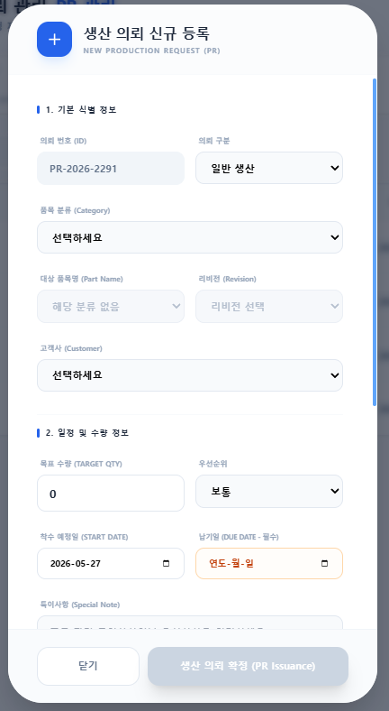
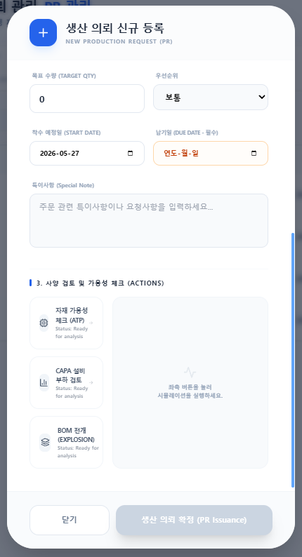

# [문서 2-12] 생산 의뢰 및 생산 계획 (Production Requests) 분석서

## 1. 컴포넌트 개요 및 이중 모드 (Dual Mode) 아키텍처
`ProductionRequestsPage.jsx`는 ERP 시스템 내에서 가장 복잡하고 방대한 로직을 포함하는 핵심 페이지 중 하나입니다. 영업 부서가 제품 생산을 요청하는 **'생산 의뢰(Sales)'** 모드와 생산 부서가 이를 바탕으로 실제 제조 일정을 잡고 현장을 통제하는 **'생산 실행(Execution/Planning)'** 모드가 하나의 파일 내에서 라우팅 주소(`location.pathname`)에 따라 동적으로 스위칭됩니다.

- **Sales 모드 (`/sales/pr` 등):** "생산 의뢰 관리" 타이틀(파란색 테마)을 가지며, 고객 주문을 기반으로 생산을 의뢰하고 판매 이력을 추적합니다.
- **Execution 모드 (`/production/...` 등):** "생산 계획 관리" 타이틀(에메랄드색 테마)을 가지며, 작업 지시, 칸반(Kanban) 보드 현황, 생산 완료 처리를 수행합니다.

---

## 2. 모드별 화면 구성 및 기능

### 2.1. 영업(Sales) 모드 서브 뷰
영업 모드에서는 세 가지 뷰 방식을 지원합니다 (`salesViewMode`).
1. **주문 리스트 (List):** `SalesListView`를 통해 테이블 형태로 전체 PR(Production Request) 상태를 확인합니다. 각 주문 내역에는 수량뿐만 아니라 **예상 판매 단가 및 총 판매 금액(Total Amount)** 필드가 함께 노출되어 영업 이익을 즉시 파악할 수 있으며, 신규 생산 의뢰(`PRRegistrationModal`)를 등록할 수 있습니다.
2. **생산 캘린더 (Calendar):** `SalesCalendarView`를 통해 주문들의 납기일(Due Date)을 달력 형태로 시각화합니다.
3. **판매 이력 (Analysis):** `SalesHistoryView`를 통해 완료/아카이브된 주문 내역을 조회합니다. 이 화면에서는 개별 주문 건의 확정 판매 금액과 이번 달 누적 판매 수량, **총 매출 합산 금액** 등 재무적 수치가 포함된 `SalesDashboard` 데이터를 제공하여 영업 성과를 한눈에 분석합니다.

### 2.2. 생산 실행(Execution) 모드 서브 뷰
현장 상황을 직관적으로 파악하기 위해 두 가지 뷰(`executionViewMode`)를 지원합니다.
1. **스플릿 뷰 (Split):** 화면을 좌우로 나누어 좌측에는 '계획 대기 중인 의뢰'를, 우측에는 '현재 생산 진행 중인 작업(프로그레스 바 포함)'을 배치합니다. 지연(Delayed)된 작업은 붉은색 경고(Pulse) 애니메이션으로 눈에 띄게 표시합니다.
2. **칸반 보드 (Kanban):** 상태별(대기, 계획/지시, 생산중, 검사/준비, 완료)로 컬럼을 나누어 카드를 시각적으로 배열합니다.

---

## 3. 핵심 비즈니스 로직 (Firestore 연동)

### 3.1. 생산 완료 시 자동화 프로세스 (WODetailModal)
작업 지시 상세 모달(`WODetailModal`)에서 상태가 **'생산 완료'**로 변경될 때, 단순 상태 업데이트에 그치지 않고 세 가지 중대한 연쇄(Transaction-like) 작업이 자동으로 실행됩니다.

1. **QA 검사 요청 자동 생성:**
   - `receiving` 컬렉션에 `Type: 'SHIPPING'`, `Status: 'WAITING_INSPECTION'`으로 문서를 생성하여 QA 부서로 품질 검사 태스크를 자동으로 넘깁니다.
2. **BOM 기반 원자재 재고 자동차감 (Backflushing):**
   - `bomService.getBOMStructure()`를 호출하여 생산 완료된 제품의 하위 자재(Children) 목록과 소요량(Quantity)을 파악합니다.
   - `(소요량 * 생산 완료 수량)` 만큼의 자재를 `transactions` 컬렉션에 출고(Out) 기록으로 남기고, `inventory` 컬렉션에서 해당 자재의 현재고(`OnHand`)를 즉각 차감(decrement)합니다.
3. **품질 상태 업데이트:** 해당 PR 문서의 `QualityStatus`를 `WAITING_INSPECTION`으로 변경합니다.

### 3.2. 상태값(Status) 파이프라인
데이터는 다음과 같은 생명주기를 거칩니다:
`임시 저장` → `생산 검토` → `의뢰 확정` → `생산 대기` → `생산 계획` → `작업 지시` → `생산 중` → `생산 완료` → `QA 검사 대기` → `QA 검사 완료` → `출하 준비` → `출하 완료` → `아카이브`

### 3.3. 생산 의뢰 등록 (PRRegistrationModal) 및 사전 검증 로직
영업(Sales) 모드에서 신규 생산 의뢰를 등록할 때, 단순 데이터 입력을 넘어 실제 생산 가능 여부를 타진하는 **사전 검증(Validation)** 절차를 거칩니다.

1. **상세 작성 항목 (Input Fields):**
   - **기본 정보:** 제품명, 품번(PartID/Revision), 목표 생산 수량(Target Qty), 고객 희망 납기일(Due Date), 우선순위(일반/긴급).
   - **영업 정보:** 대상 고객사(Customer), 예상 판매 단가(Unit Price), 특별 요청 사항 및 비고(Remarks).
2. **사양 검토 (Specification Review):**
   - 의뢰할 완제품을 선택하면 시스템이 DB(`parts` 컬렉션)에서 해당 제품의 최신 **리비전(Revision)**, **승인된 도면**, **스펙(Specification)** 정보를 팝업에 즉각 렌더링합니다. 영업 담당자가 구버전 도면이나 잘못된 스펙으로 발주하는 휴먼 에러를 원천 차단하기 위한 크로스체크 단계입니다.
3. **자재 및 생산 가용성 체크 (Availability Check):**
   - **자재 가용성(Material Check):** 제품 선택 및 수량 입력 시, 시스템이 백그라운드에서 해당 제품의 `BOM(자재명세서)`을 전개(Explosion)하고, 창고의 실시간 `Inventory(현재고)`와 대조합니다. 만약 주문 수량을 맞추기 위해 특정 부품이 모자랄 경우(Shortage), 미리 경고를 띄워 구매 부서에 발주(PO)를 유도합니다.
   - **생산 라인 여력(Capacity Check):** 납기일(Due Date)까지 현재 현장의 활성 작업(`작업 지시`, `생산 중`) 부하량을 고려하여, 납기 준수가 가능한지 생산 계획(Planning) 단계 이전에 영업 부서가 1차적으로 가용성을 판단할 수 있도록 지원합니다.

---

## 4. UI 화면 (스크린샷 자리표시자)

> **생산 의뢰(Sales) 모드 대시보드 및 리스트 뷰**
> 

> **생산 계획(Execution) 모드 스플릿 뷰 (좌: 대기 / 우: 진행중)**
> 

> **생산 계획(Execution) 모드 칸반 보드 뷰**
> 

> **생산 작업 완료 및 재고 자동차감 모달 (WODetailModal)**
> 

---

## 5. 기능 추가 및 수정/보완 요청사항 (Action Items)

> 방대한 생산 의뢰 데이터를 효율적으로 관리하고 실제 공장 운영을 고도화하기 위한 필수 기능들입니다.

1. **[기능 추가] 다중 복합 필터 (Advanced Filtering) 기능:**
   - **개선안:** 수백 건의 주문 중 원하는 데이터를 즉시 찾기 위해 리스트 뷰 상단에 강력한 다중 필터바 추가.
   - **적용 항목:** 품명(텍스트 검색), 고객사(텍스트 검색), 요청 날짜 및 납기일(Date Range), 상태값 전체(다중 선택 Checkbox), 고객사 지역구분(국내/해외) 등 가능한 모든 메타데이터를 조건으로 필터링.

2. **[기능 추가] 컬럼별 다중 정렬 (Sorting) 기능:**
   - **개선안:** 리스트 뷰의 테이블 헤더를 클릭하여 사용자가 원하는 기준(납기일 임박순, 등록일 역순, 타겟 수량 크기순 등)으로 오름차순(ASC) 및 내림차순(DESC) 정렬이 가능하도록 UI 보완.

3. **[기능 추가] 엑셀/스프레드시트 내보내기 (Export to Excel) 기능:**
   - **개선안:** 화면에 필터링 및 정렬된 현재 리스트 상태 그대로를 원클릭으로 엑셀(.xlsx)이나 CSV 파일로 다운로드할 수 있는 **[Excel 저장] 버튼** 추가. (주간 회의 및 경영진 보고용 데이터 추출 목적)

4. **[기능 보완] 재고 차감 시 부족(Shortage) 사전 경고 시스템:**
   - **개선안:** 현재는 생산 완료 시 재고가 즉각 차감(Negative 허용)되는 구조이나, 작업 지시 전 또는 완료 직전에 `(창고 현재고 - 소요 예정량)`을 스캔하여 재고가 부족한 자재를 붉은색으로 팝업 경고해 주는 Validation 로직 추가.

5. **[기능 보완] 불량(Defect) 자재 폐기 및 재작업 프로세스:**
   - **개선안:** 작업자가 불량 수량을 입력할 때, 해당 불량품의 사유 코드를 입력받고 시스템 상의 '불량 창고(Scrap Bin)' 위치로 재고를 이동시키거나 재작업(Rework) 오더를 자동 파생시키는 로직 보완.
