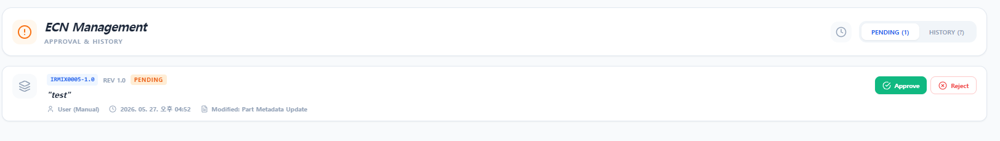
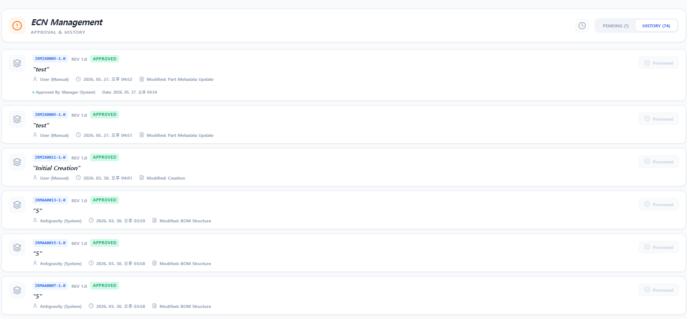

# [문서 2-6] ECN (설계 변경) 분석서

## 1. ECN 기능 개요 및 목적
`ECNPage` 컴포넌트는 ERP 시스템에서 설계 변경 요구(Engineering Change Notice)를 승인하고 이력을 관리하는 화면입니다. 주로 제품 개발 부서(`engineer`)가 부품이나 BOM 스펙 변경을 요청하면, 관리자(`manager`)가 이 내역(Pending)을 검토한 후 승인(Approve) 또는 반려(Reject)하는 프로세스를 전담합니다. 승인 시 시스템은 자동으로 기존 도면/부품의 리비전(Revision)을 올리고 하위 BOM 관계를 업데이트하는 중요한 역할을 수행합니다.

---

## 2. 보기 방식 및 UI 구조
화면은 처리 상태에 따라 크게 두 가지 뷰 모드(View Mode)를 제공하며 우측 상단 토글 버튼을 통해 전환합니다.

1. **PENDING 모드:**
   - 아직 관리자의 승인을 받지 못한 `Status === 'Pending'` 상태의 ECN 안건들만 필터링하여 보여줍니다.
   - 각 안건의 우측에는 [Approve] 및 [Reject] 액션 버튼이 노출됩니다.
2. **HISTORY 모드:**
   - 이미 승인(Approved)되거나 반려(Rejected)된 ECN 처리 이력들을 최신순(CreatedAt 역순)으로 보여줍니다.
   - 처리 결과 아이콘(Processed)과 함께 처리자(`ApprovedBy` 또는 `RejectedBy`)와 처리 일시가 노출됩니다.

---

## 3. 핵심 로직: ECN 승인 (handleApprove) 트랜잭션 흐름
이 화면에서 가장 중요한 로직은 관리자가 ECN을 "승인"할 때 Firestore 상에서 연쇄적으로 발생하는 **리비전 업(Revision-up) 자동화**입니다. `writeBatch(db)`를 이용해 원자적 트랜잭션으로 처리됩니다.

### 3.1. 마스터 부품(Part) 갱신
1. 원본 부품의 `IsLatestRevision` 플래그를 `false`로 변경하여 메인 리스트에서 감춥니다.
2. `getNextRevision` 함수를 통해 리비전 번호(예: 1.0 -> 1.1)를 증가시킵니다.
3. 새로운 `PartID`(`MasterPartID-NewRev`)를 생성하고, 기존 스펙을 상속받은 새 부품 데이터를 `parts` 컬렉션에 `IsLatestRevision: true`로 새로 Insert(생성)합니다.

### 3.2. 하위 BOM 관계(Relationship) 업데이트
- ECN 요청 시 포함된 **ProposedBOM** 배열이 존재할 경우, 새롭게 생성된 리비전의 `PartID`를 부모(ParentID)로 삼도록 구조를 변경합니다.
- 중복 방지를 위해 기존 조립 관계를 모두 지우고(Clear) 새로운 링크를 `bom` 컬렉션에 일괄 세팅(Batch Set)하여 설계 변경 사항을 즉각적으로 새 리비전 제품의 BOM에 반영합니다.

---

## 4. 상세 내역 보기 (ECNDetailModal)
ECN 목록에서 개별 카드를 클릭하면 대형 모달이 열려 변경점의 세부 내역을 표시합니다.

- **기본 정보:** 요청 사유(Reason), 상태(Status), 타입(Type), 요청자, 일시 등
- **상세 변경점 (Changes Diff):** `Changes` 필드에 배열 형태로 저장된 "변경 전 → 변경 후" 텍스트 매핑 데이터를 분석하여, 어떤 필드(예: 규격, 비고, 단가)가 구체적으로 어떻게 수정되었는지 파악하기 쉽게 출력해 줍니다.

---

## 5. UI 화면 (스크린샷 자리표시자)

> **ECN 메인 화면 (Pending 탭 / 승인 대기 리스트)**
> 

> **ECN 메인 화면 (History 탭 / 처리 이력 리스트)**
> 

> **ECN 상세 모달 (변경 사유 및 Diff 변경점 조회)**
> 

---

## 6. 기능 추가 및 수정 요청사항 (Action Items)

> 기존의 단순 관리자 승인(Manager Approve) 방식을 넘어, 실제 기업 환경에 맞는 고도화된 전자결재 및 상세 내역 조회 기능을 추가해야 합니다.

1. **[기능 추가] Pending 안건 다단계 결재(Multi-level Approval) 시스템 구축:**
   - **현황:** 현재는 관리자 권한을 가진 누구나 한 번의 [Approve] 클릭으로 ECN을 승인할 수 있습니다.
   - **개선안:** 
     - 각 안건에 대해 사전에 **결재 라인(기안자 → 검토자 → 승인자 → 최종 결재자)**을 정의할 수 있도록 결재 프로세스를 고도화.
     - 정의된 결재 순서에 따라 본인의 차례가 왔을 때만 승인 버튼이 활성화되며, 하위 결재자가 승인해야 다음 단계 관리자의 승인이 가능해지도록 순차적 락(Lock) 기능을 적용.
     - 최종 결재자가 승인(Final Approve) 버튼을 눌러야만 비로소 실제 리비전 업(Revision-up) 트랜잭션이 실행되도록 시스템 구조를 변경.

2. **[기능 보완] ECN 상세 내역 클릭 시 표출 정보 강화 (제품명, 리비전, 하위 BOM 리스트):**
   - **현황:** 현재 상세 내역(`ECNDetailModal`)에는 변경 사유(Reason)와 텍스트 기반의 변경점(Changes 배열)만 노출됩니다.
   - **개선안:** 해당 내역을 클릭하여 상세 모달이 열릴 때, 변경 대상인 **제품명(품명)**과 직관적인 **리비전 명칭(예: Rev 1.0 → Rev 1.1)**이 눈에 띄게 상단에 표출되도록 UI 보완. 또한 해당 제품/조립품을 구성하는 **하위 부품 리스트(Sub-BOM List) 내역**까지 상세 페이지에서 즉시 조회할 수 있도록 테이블 형태의 뷰를 추가.
